# 📖 Guía de Desarrollo y Evolución del Proyecto

Este documento narra el viaje de desarrollo del Clasificador de Iris, desde las pruebas manuales iniciales hasta la arquitectura final orquestada con Docker Compose. El objetivo es servir como una guía de aprendizaje para entender las decisiones técnicas tomadas en cada fase.

---

## Fase 0: Entrenamiento del Modelo de Machine Learning

Antes de que la aplicación pueda hacer predicciones, necesita un modelo entrenado. Este proceso se realiza una sola vez (o cada vez que se quiera actualizar el modelo) y se encapsula en el script `iris_app/model/train_model.py`.

### Proceso de Entrenamiento

El script sigue los pasos estándar de un flujo de trabajo de Machine Learning:

1.  **Carga de Datos:** Se utiliza el dataset `iris` de Scikit-learn.
2.  **División de Datos:** El dataset se divide en conjuntos de entrenamiento y prueba.
3.  **Entrenamiento:** Se instancia y entrena un clasificador `RandomForestClassifier`.
4.  **Serialización (Guardado):** El modelo entrenado se guarda en un archivo `modelo.pkl` usando `joblib`. Esto permite que la API lo cargue rápidamente sin necesidad de reentrenar.
    ```python
    # iris_app/model/train_model.py
    joblib.dump(model, "iris_app/model/modelo.pkl")
    ```
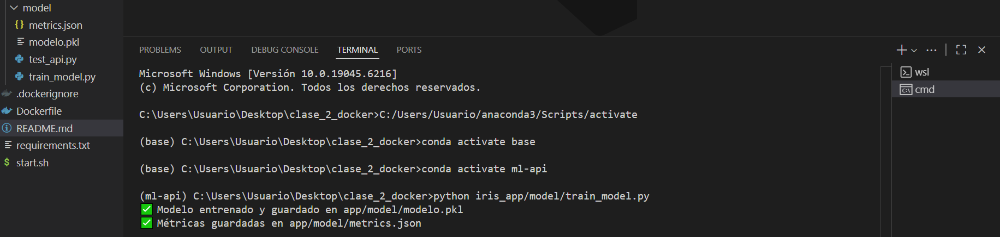

5.  **Generación de Métricas:** Se evalúa el modelo con los datos de prueba y se guardan métricas como `accuracy` y la matriz de confusión en `metrics.json`.

### ¿Cómo lo usa la API?

La API (`api/app.py`) está diseñada para ser *stateless* en cuanto al entrenamiento. Simplemente carga el artefacto pre-entrenado (`modelo.pkl`) cuando se inicia.

```python
# iris_app/api/app.py
modelo = joblib.load("iris_app/model/modelo.pkl")
```

Este desacoplamiento es crucial: el entrenamiento es un proceso de desarrollo/investigación, mientras que la predicción es una tarea de producción.

## Fase 1: Desarrollo y Pruebas Manuales (Sin Docker)

El proyecto comenzó con dos scripts de Python independientes: uno para la API (`api/app.py`) y otro para el frontend (`frontend/frontend.py`).

### Ejecución

1.  **API (Flask):** Se ejecutaba directamente. El servidor de desarrollo de Flask es ideal para esta etapa.
    ```bash
    python iris_app/api/app.py
    ```
    *Salida esperada en la terminal:*

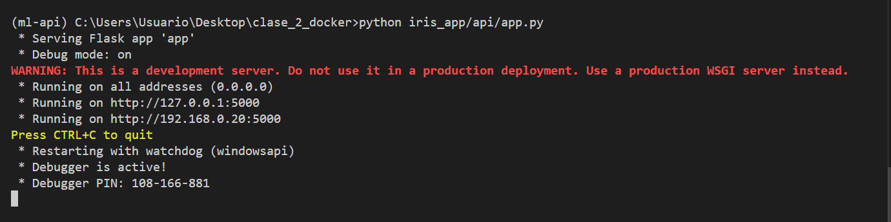

2.  **Frontend (Streamlit):** Se lanzaba en una terminal separada.
    ```bash
    streamlit run iris_app/frontend/frontend.py
    ```
    *Salida esperada en la terminal:*

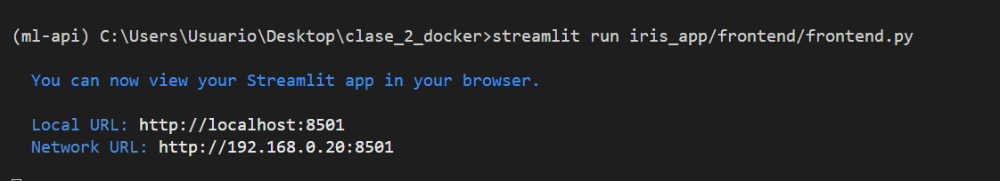

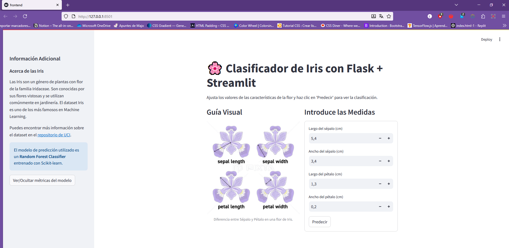

    
### Pruebas Manuales de la API

Las primeras validaciones se hicieron con `curl` para asegurar que los endpoints respondían correctamente.

**Prueba de salud (`/health`):**
```bash
curl http://127.0.0.1:5000/health
# Respuesta esperada: {"status":"API funcionando","model":"Iris-RandomForest"}
```
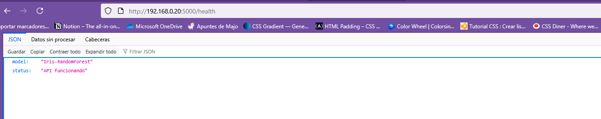

**Prueba de predicción (`/predict`):**
```bash
curl -X POST http://127.0.0.1:5000/predict \
  -H "Content-Type: application/json" \
  -d '{"features": [5.1, 3.5, 1.4, 0.2]}'
# Respuesta esperada: {"prediction":0, "probabilities":[...]}
```
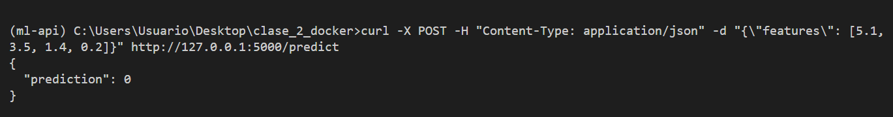

**Prueba de predicción con datos no válidos(`/predict`):**
```bash
curl -X POST http://127.0.0.1:5000/predict \
  -H "Content-Type: application/json" \
  -d '{"features": [1, 2, 3, 4]}'
# Respuesta esperada: {"error":Datos mal estructurados"}
```
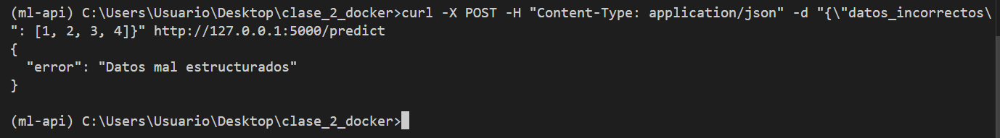

**Limitación:** Este enfoque requiere que cada desarrollador configure su propio entorno de Python, instale dependencias manualmente y gestione dos procesos en terminales separadas. Es propenso a errores de "en mi máquina funciona".

**Prueba con el archivo test_api.py de la API:**
```bash
python iris_app/model/test_api.py
```
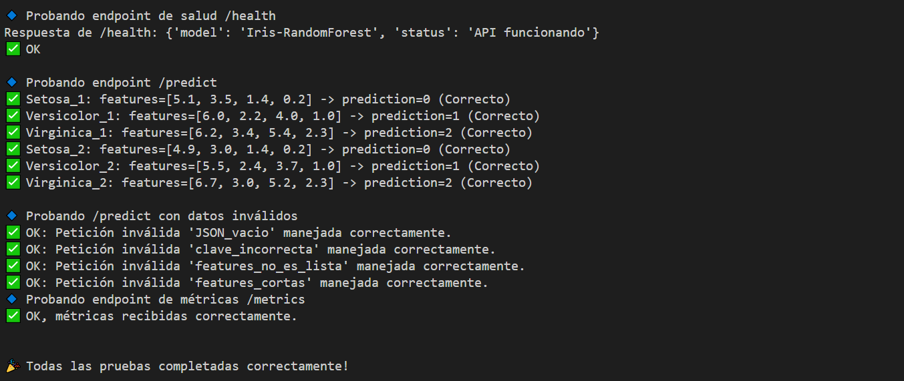

---

## Fase 2: Contenerización Inicial con `Dockerfile` y `start.sh`

Para resolver el problema de la configuración del entorno, se introdujo Docker. El objetivo era empaquetar toda la aplicación en una sola imagen.

### El Desafío: Dos Procesos, Un Contenedor

Un contenedor Docker está diseñado para ejecutar un solo proceso principal. Para ejecutar tanto la API como el frontend, se creó un script de shell (`start.sh`) que actuaba como punto de entrada.

```shell
#!/bin/bash
# Iniciar la API de Flask en segundo plano
waitress-serve --host=0.0.0.0 --port=5000 iris_app.api.app:app &

# Iniciar el frontend de Streamlit en primer plano
streamlit run iris_app/frontend/frontend.py --server.port=8501 --server.address=0.0.0.0
```

El `Dockerfile` se configuró para copiar este script y ejecutarlo con `CMD ["./start.sh"]`.

### Comandos de Docker

1.  **Construir la imagen:**
    ```bash
    docker build -t iris-classifier .
    ```

2.  **Ejecutar el contenedor:**
    ```bash
    docker run -p 5000:5000 -p 8501:8501 --name iris-app iris-classifier
    ```
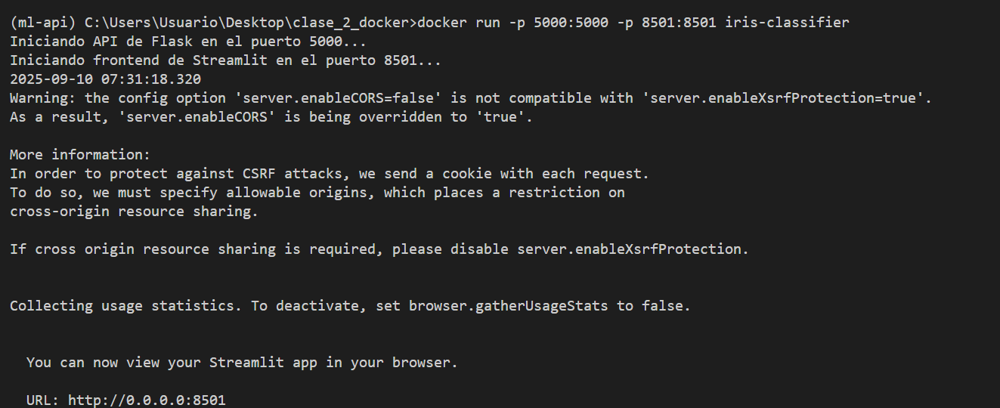

**Ventaja:** La aplicación ahora es portable. Cualquiera con Docker puede ejecutarla con dos comandos.

**Limitaciones:**
-   **Anti-patrón de Docker:** Va en contra de la filosofía de "un proceso por contenedor".
-   **Sin escalabilidad granular:** No se puede escalar la API sin escalar también el frontend.
-   **Gestión compleja:** Si la API falla, el contenedor podría seguir funcionando, ocultando el problema.

---

## Fase 3: Orquestación Profesional con Docker Compose

Para superar las limitaciones anteriores y adoptar las mejores prácticas, se introdujo `docker-compose`.

### La Solución: Servicios Separados

`docker-compose.yml` define la aplicación como un conjunto de **servicios** interconectados.

1.  **Servicio `api`:** Un contenedor que ejecuta únicamente la API de Flask con `waitress`.
2.  **Servicio `frontend`:** Un segundo contenedor que ejecuta únicamente Streamlit.

Docker Compose se encarga de:
-   **Construir la imagen** a partir del `Dockerfile` (que ya no necesita `start.sh`).
-   **Crear una red virtual** para que los contenedores se comuniquen entre sí. El frontend puede llamar a la API usando su nombre de servicio (`http://api:5000`).
-   **Gestionar el ciclo de vida** de la aplicación con comandos simples.

### Comandos de Docker Compose

El flujo de trabajo se simplifica enormemente:
```bash
# Levantar toda la aplicación (construye si es necesario)
docker-compose up --build
```
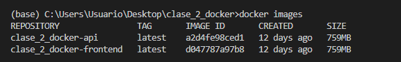

Ya que están las imágenes construidas, en futuras ejecuciones basta con:
```bash
docker-compose up
```
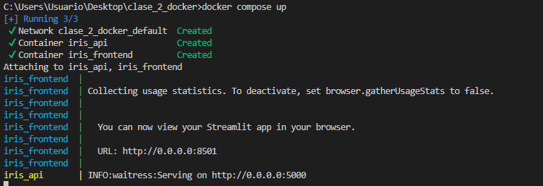

# Detener y eliminar todo
```bash
docker-compose down
```
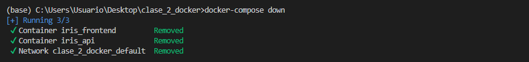

**Ventajas:**
-   **Alineado con las mejores prácticas:** Un proceso por contenedor.
-   **Escalable y mantenible:** Cada parte de la aplicación es independiente.

Esta arquitectura final es robusta, profesional y está lista para entornos de producción.