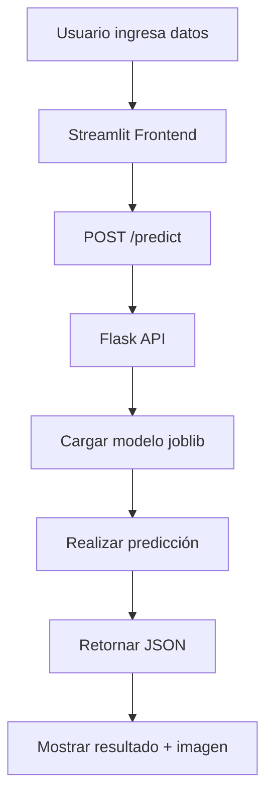

# 🌸 Clasificador de Iris con Flask + Streamlit

> Creado por **Liliana Garmendia**

Un proyecto completo de machine learning que implementa un **clasificador de flores Iris** usando **Random Forest**. Incluye una API REST con Flask, un frontend interactivo con Streamlit y está **orquestado con Docker Compose** para un despliegue sencillo y reproducible.

---
**Flask Demo:**


**Streamlit Demo:**


## ✨ Características

-   🤖 **Modelo de Machine Learning**: Clasificador `RandomForestClassifier` entrenado con el dataset Iris y serializado con `joblib`.
-   🚀 **API RESTful con Flask**: API robusta para servir el modelo, con endpoints claros para predicciones, estado y métricas.
-   🎨 **Frontend Interactivo**: Interfaz de usuario amigable construida con Streamlit para interactuar con el modelo de forma visual.
-   🐳 **Orquestación con Docker Compose**: El proyecto está completamente contenerizado, permitiendo un despliegue y ejecución sencillos con un solo comando.
-   ✅ **Pruebas Automatizadas**: Incluye un script (`test_api.py`) para validar el correcto funcionamiento de todos los endpoints de la API.
-   📈 **Manejo de Métricas**: El modelo genera y expone métricas de rendimiento como *accuracy* y la matriz de confusión.

## 📂 Estructura del Proyecto

```bash
iris_project/
├── iris_app/
│   ├── api/
│   │   └── app.py              # API Flask
│   ├── frontend/
│   │   └── frontend.py         # Frontend Streamlit
│   └── model/
│       ├── train_model.py      # Script de entrenamiento
│       ├── test_api.py         # Script de pruebas
│       ├── modelo.pkl          # Modelo serializado
│       └── metrics.json        # Métricas del modelo
├── Dockerfile                  # Receta para construir la imagen
├── docker-compose.yml          # Orquestador de servicios
├── requirements.txt            # Dependencias de Python
└── README.md                   # Este archivo
```

---

## 🤖 Modelo de Machine Learning

El corazón del proyecto es un modelo de clasificación `RandomForestClassifier` de la librería Scikit-learn, una elección robusta para este tipo de problemas.

-   **Dataset**: Se utiliza el clásico dataset "Iris", que contiene 150 muestras de flores, cada una con 4 características (largo y ancho de sépalos y pétalos) y una de tres especies (Setosa, Versicolor, Virginica).
-   **Entrenamiento**: El script `iris_app/model/train_model.py` se encarga de todo el proceso: carga los datos, los divide en conjuntos de entrenamiento y prueba, entrena el clasificador y lo evalúa.
-   **Serialización**: Una vez entrenado, el modelo se guarda en el archivo `modelo.pkl` usando `joblib`. Esto permite que la API lo cargue y lo utilice para predicciones sin necesidad de reentrenar en cada ejecución, asegurando un inicio rápido y eficiente.
-   **Métricas**: Durante el entrenamiento, también se generan y guardan métricas de rendimiento como el *accuracy* y un reporte de clasificación detallado en `metrics.json`, que luego son expuestas por la API.

---

## 🚀 API REST con Flask

La API, construida con Flask y servida con el servidor de producción WSGI `Waitress`, expone el modelo de machine learning a través de varios endpoints bien definidos.

### Endpoints Disponibles

#### `GET /`
-   **Descripción**: Endpoint raíz que devuelve un mensaje de bienvenida. Útil para una verificación rápida de que la API está en línea.
-   **Respuesta Exitosa (200)**:
    ```json
    { "message": "Bienvenido a la API del Clasificador de Iris. Visita /health para ver el estado." }
    ```

#### `GET /health`
-   **Descripción**: Endpoint de "salud" que confirma que la API está funcionando y que el modelo se ha cargado correctamente.
-   **Respuesta Exitosa (200)**:
    ```json
    { "status": "API funcionando", "model": "Iris-RandomForest" }
    ```

#### `POST /predict`
-   **Descripción**: El endpoint principal para realizar predicciones. Recibe las 4 características de una flor y devuelve la especie predicha y las probabilidades asociadas.
-   **Cuerpo de la Petición (JSON)**:
    ```json
    { "features": [5.1, 3.5, 1.4, 0.2] }
    ```
-   **Respuesta Exitosa (200)**:
    ```json
    { "prediction": 0, "probabilities": [0.98, 0.02, 0.0] }
    ```
-   **Manejo de Errores (400)**: Devuelve un error si el JSON está mal formado o si la lista de `features` no contiene 4 elementos.

#### `GET /metrics`
-   **Descripción**: Proporciona las métricas de rendimiento del modelo que se generaron durante la fase de entrenamiento.
-   **Respuesta Exitosa (200)**: Devuelve un objeto JSON con el `accuracy`, el `classification_report` y la `confusion_matrix`.

---

## 🎨 Frontend Interactivo con Streamlit

La interfaz de usuario, desarrollada con Streamlit, proporciona una forma visual e intuitiva de interactuar con el modelo de clasificación sin necesidad de escribir código o usar la línea de comandos.

-   **Entrada de Datos Sencilla**: El usuario puede ajustar las cuatro características de la flor (largo y ancho de sépalos y pétalos) mediante campos numéricos interactivos.
-   **Predicción Instantánea**: Al hacer clic en "Predecir", el frontend envía una solicitud a la API de Flask y muestra el resultado de forma clara, incluyendo:
    -   El nombre de la especie predicha (Setosa, Versicolor o Virginica).
    -   Una imagen representativa de la flor.
    -   Una descripción detallada y curiosidades sobre la especie.
-   **Visualización de Confianza**: Se presenta un gráfico de barras que muestra la probabilidad que el modelo asigna a cada una de las tres clases. Esto permite al usuario entender no solo *qué* predice el modelo, sino con *cuánta seguridad*.
-   **Métricas de Rendimiento**: A través de un botón en la barra lateral, el usuario puede solicitar y visualizar las métricas de rendimiento del modelo (obtenidas del endpoint `/metrics` de la API), incluyendo:
    -   **Accuracy** global.
    -   Un **reporte de clasificación** detallado por clase.
    -   Una **matriz de confusión** visualizada como un mapa de calor.

---

## 🚀 Uso del Sistema

Puedes ejecutar este proyecto de tres maneras: usando Docker (recomendado), localmente con Python/venv, o localmente con Conda.

---

### Opción 1: Ejecutar con Docker (Recomendado)

Esta es la forma más sencilla de levantar toda la aplicación con un solo comando.

#### Requisitos
- **Docker** y **Docker Compose**

#### Pasos

1.  **Levantar la aplicación:**
    Abre una terminal en la raíz del proyecto y ejecuta:
    ```bash
    docker-compose up --build
    ```
    Este comando construirá la imagen, creará y levantará los contenedores de la API y el frontend.

2.  **Acceder a los servicios:**
    -   **Frontend Streamlit**: Abre tu navegador y ve a `http://localhost:8501`

    

    -   **Frontend Streamlit** de una predicción:

    

    -   **API Flask**: Los endpoints son accesibles en `http://localhost:5000` (ej. `http://localhost:5000/health`).

    

    


3.  **Validar la API (Opcional):**
    Mientras la aplicación está corriendo, abre otra terminal y ejecuta el script de pruebas dentro del contenedor de la API:
    ```bash
    docker-compose exec api python iris_app/model/test_api.py
    ```

4.  **Detener la aplicación:**
    Para detener y limpiar el entorno, presiona `Ctrl + C` en la terminal donde ejecutaste `docker-compose up` y luego ejecuta:
    ```bash
    docker-compose down
    ```
    Este comando es importante ya que no solo detiene los contenedores, sino que también los elimina y remueve la red creada, asegurando un entorno limpio para la próxima vez que levantes la aplicación.

    **Nota:** Si también deseas eliminar las imágenes de Docker construidas por Compose para liberar espacio, puedes usar el siguiente comando:
    ```bash
    docker-compose down --rmi all
    ```

---

### Opción 2: Ejecutar Localmente con Python

Sigue estos pasos si prefieres no usar Docker y ejecutar los servicios directamente en tu máquina.

#### Requisitos
- Python 3.10 o superior
- pip (gestor de paquetes de Python)

#### Pasos

1.  **Clonar el repositorio:**
    ```bash
    git clone https://github.com/LiliGC/iris-classifier-flask-streamlit.git
    cd iris-classifier-flask-streamlit
    ```

2.  **Crear y activar un entorno virtual:**
    Es una buena práctica aislar las dependencias del proyecto.
    ```bash
    # Crear el entorno
    python -m venv .venv
    
    # Activar en Windows
    .venv\Scripts\activate
    
    # Activar en macOS/Linux
    # source .venv/bin/activate
    ```

3.  **Instalar dependencias:**
    ```bash
    pip install -r requirements.txt
    ```

4.  **Ejecutar la API:**
    Abre una terminal (con el entorno virtual activado) y ejecuta:
    ```bash
    waitress-serve --host=127.0.0.1 --port=5000 iris_app.api.app:app
    ```

5.  **Ejecutar el Frontend:**
    Abre una **segunda terminal** (y activa el entorno virtual también) y ejecuta:
    ```bash
    streamlit run iris_app/frontend/frontend.py
    ```
    El frontend estará disponible en `http://localhost:8501`.

6.  **Validar la API (Opcional):**
    Abre una **tercera terminal** y ejecuta el script de pruebas:
    ```bash
    python iris_app/model/test_api.py
    ```

    !Prueba con el archivo test_api.py de la API

---

### Opción 3: Ejecutar Localmente con Conda

Sigue estos pasos si prefieres usar Conda para gestionar tu entorno.

#### Requisitos
- Anaconda o Miniconda

#### Pasos

1.  **Clonar el repositorio y navegar al directorio.**

2.  **Crear y activar el entorno Conda:**
    Este comando creará un entorno llamado `ml-api` con todas las dependencias del archivo `environment.yml`.
    ```bash
    conda env create -f environment.yml
    conda activate ml-api
    ```

3.  **Ejecutar la API:**
    En una terminal con el entorno `ml-api` activado, ejecuta:
    ```bash
    waitress-serve --host=127.0.0.1 --port=5000 iris_app.api.app:app
    ```

4.  **Ejecutar el Frontend:**
    En una **segunda terminal** (con el entorno `ml-api` activado), ejecuta:
    ```bash
    streamlit run iris_app/frontend/frontend.py
    ```

---

### Probar la API con cURL

```bash
curl -X POST http://127.0.0.1:5000/predict \
  -H "Content-Type: application/json" \
  -d '{"features": [5.1, 3.5, 1.4, 0.2]}'
```

**Respuesta esperada:**
```json
{ "prediction": 0, "probabilities": [0.98, 0.02, 0.0] }
```

---

## 🎯 Clases de Flores Iris

| Clase        | ID | Características                  | Imagen                                                              |
|--------------|----|----------------------------------|---------------------------------------------------------------------|
| **Setosa**     | 0  | Pétalos pequeños, sépalos anchos |             |
| **Versicolor** | 1  | Tamaño intermedio                |     |
| **Virginica**  | 2  | Pétalos grandes, sépalos largos  |       |

---

## 🧪 Ejemplos de Predicción

El array `features` sigue el orden: `[largo_sépalo, ancho_sépalo, largo_pétalo, ancho_pétalo]` en cm.

### Iris Setosa
```json
{"features": [5.1, 3.5, 1.4, 0.2]} → Predicción: 0 (Setosa)
```

### Iris Versicolor
```json
{"features": [7.0, 3.2, 4.7, 1.4]} → Predicción: 1 (Versicolor)  
```

### Iris Virginica
```json
{"features": [6.3, 3.3, 6.0, 2.5]} → Predicción: 2 (Virginica)
```

---

## 🛠️ Desarrollo

El uso de `volumes` en el `docker-compose.yml` sincroniza tu código local con el de los contenedores. Esto significa que puedes modificar `app.py` o `frontend.py` en tu editor de código, y los cambios se reflejarán automáticamente sin necesidad de reconstruir la imagen (aunque en algunos casos, como el de Streamlit, puede que necesites refrescar la página).

### Reentrenar el modelo
Si quieres reentrenar el modelo, puedes ejecutar el script de entrenamiento. Si usas Docker, hazlo dentro del contenedor:
```bash
docker-compose exec api python iris_app/model/train_model.py
```
Si lo haces localmente, asegúrate de tener el entorno virtual o de conda activado y ejecuta:
```bash
python iris_app/model/train_model.py
```

---

## 🔄 Flujo de Trabajo



---

## 📚 Próximos Pasos

### Mejoras Sugeridas
- [ ] 🔄 Implementar CI/CD con GitHub Actions
- [ ] ☁️ Despliegue en nube (Heroku, AWS, GCP)
- [x] 📊 Agregar métricas del modelo (accuracy, confusion matrix) - ¡Implementado!
- [ ] 🎨 Mejorar diseño del frontend con CSS personalizado
- [ ] 📝 Agregar logging detallado
- [ ] 🔒 Implementar autenticación en la API
- [x] 📦 Crear docker-compose para orquestación completa - ¡Implementado!

### Extensiones Avanzadas
- [ ] 🤖 Comparar múltiples algoritmos (SVM, Neural Networks)
- [ ] 📈 Dashboard de monitoreo con métricas en tiempo real
- [ ] 🔄 Reentrenamiento automático del modelo
- [ ] 📱 Aplicación móvil con React Native
- [ ] 🌐 Interfaz multi-idioma

---

## 🤝 Contribución

1. Fork el proyecto
2. Crear una rama de feature (`git checkout -b feature/nueva-caracteristica`)
3. Commit los cambios (`git commit -am 'Agregar nueva característica'`)
4. Push a la rama (`git push origin feature/nueva-caracteristica`)
5. Abrir un Pull Request

---

## 📄 Licencia

Este proyecto está bajo la Licencia MIT.

---

## 🔗 Recursos Útiles

- 📚 **Flask**: [Documentación oficial](https://flask.palletsprojects.com/)
- 🎨 **Streamlit**: [Documentación oficial](https://docs.streamlit.io/)
- 🧠 **Scikit-learn**: [Guía del usuario](https://scikit-learn.org/stable/user_guide.html)
- 💾 **Joblib**: [Documentación](https://joblib.readthedocs.io/)
- 🌸 **Dataset Iris**: [UCI ML Repository](https://archive.ics.uci.edu/ml/datasets/iris)

---

## 🐛 Solución de Problemas

### Error: Puerto en uso
```bash
OSError: [Errno 48] Address already in use
```
**Solución**: Cambia el puerto o mata el proceso:
```bash
lsof -ti:5000 | xargs kill -9  # Para Flask
lsof -ti:8501 | xargs kill -9  # Para Streamlit
```

### Error: Módulo no encontrado
```bash
ModuleNotFoundError: No module named 'flask'
```
**Solución**: Reinstala las dependencias:
```bash
pip install -r requirements.txt
```

---

**¡Disfruta clasificando flores Iris! 🌸**